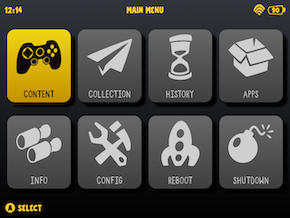
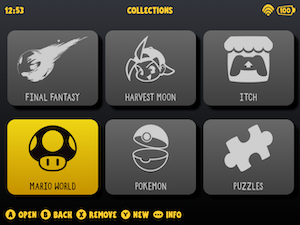
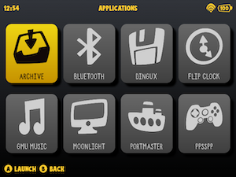
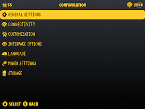

# muOS Custom Pixie Grid Theme
Baisc customized theme for muOS (RG35xx H or any 640x480 compatible device)

## Contents
- [About](#about-this-theme)
- [Screenshots](#screenshots-and-images)
- [Credits](#credits)
- [Made With](#made-with)

# ABOUT THIS THEME

A customized version of the original **muOS - Pixie Theme**, tailored to enhance visuals. This theme brings a playful, clean aesthetic with a practical grid layout on the Collections/Favorites for a smoother user experience.

## ✨ What’s New in This Custom Theme:

- **Custom Icons**: A fresh set of icons for a unique and polished look;
- **Font Update**: More stylish font choices for a creative feel;
- **Grid Layout**: Favorites and Collections views now feature a **grid layout**, making it easier to browse and organize.

## 📦 Based On:

Originally built on the **Pixie Theme** for [muOS](https://theme.muos.dev/, this version retains its lightweight charm while introducing visual and functional improvements.

## 🎨 Ideal For:

Users who love clean interfaces, prefer a grid-based layout for navigation, and want their muOS handheld to have a bit more personality and creative visual feel to it.

## SCREENSHOTS AND IMAGES

# CREDITS
By [Jessika Rocha](https://games.jessikarocha.com/)

Main Menu Icons by Mario del Valle Guijarro 
 - [Captain icon pack](https://mariodelvalle.github.io/CaptainIconWeb/)

Boot logo and various images by [Jessika Rocha](https://games.jessikarocha.com/)

Header and Footer Font: [Wasted Willy Font](https://creativemarket.com/MightySHORT/5493800-Wasted-Willie-Font) by MightySHORT

Overall Theme Font: [Taco and Tequila](https://creativemarket.com/DesignSurplus/57200-Taco-and-Tequila-2-Fonts-Extras%21) by Design Surplus

# Made With

